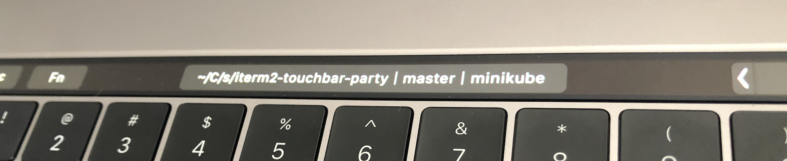

# iTerm2 Touchbar Party

iTerm2 Touchbar Party is a combination of scripts that make your Mac's Touchbar userful when using iTerm2.



## Installation

### Homebrew Installation (Preferred)

1. Tap the i2tp repository
    ```shell
    brew tap snooc/iterm2-touchbar-party
    ```

2. Run brew install
    ```shell
    brew install iterm2-touchbar-party
    ```

3. Add i2tp to your `.bash_profile`
    ```shell
    if [[ -f "/usr/local/opt/iterm2-touchbar-party/share/iterm2-touchbar-party.sh" ]]; then
        source "/usr/local/opt/iterm2-touchbar-party/share/iterm2-touchbar-party.sh"
        export PROMPT_COMMAND="__i2tp"
    fi
    ```

### Manual Installation (Using git)

1. Clone this repository
    ```shell
    git clone git@github.com:snooc/iterm2-touchbar-party.git
    ```
2. Source `iterm2-touchbar-party.sh` and add i2tp to your `PROMPT_COMMAND` in `~/.bash_profile`
    ```shell
    source path/to/iterm2-touchbar-party.sh
    export PROMPT_COMMAND="__i2tp"
    ```

## License

[MIT License](./LICENSE)
